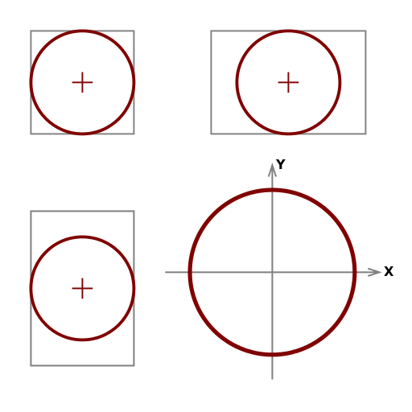

# gofra

`gofra` is simple fractal render library.

## Installation

To install `gofra`, simply run:
```
go get github.com/gitchander/gofra
```

## Getting started console util

Сonsole rendering program exists in the directory `gofra/fractus`

Util used package: [cli.go](https://github.com/codegangsta/cli)

You will build console program:
```
$ go build
```

### Make default
For make default file config:
```
$ ./fractus default
```
in this case the file will be created `fractal.json`

### Render fractal
For render first fractal, run:
```
$ ./fractus render
```
created image file `fractal.png`

you can watch it in any viewer program.

### Scale fractal

```
$ ./fractus scale 2
```
changed scale factor in configuration file.
for rebuild fractal you will render again.

### Move position

For move center position used command move x y, where x and y relative coordinate values in range [-1.0 ... +1.0].
```
$ ./fractus move 0.5 0
```

If x or y is negative value you nead use next sintax
```
$ ./fractus move -- 0.1 -0.58
```
Placement a circle for positioning:


