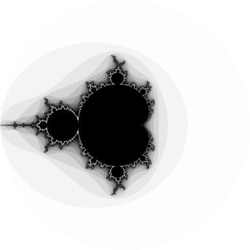
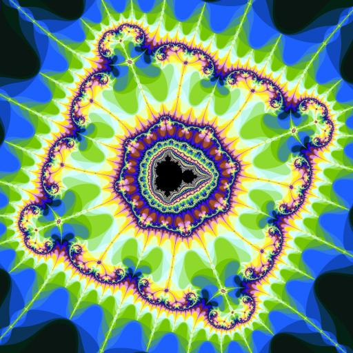
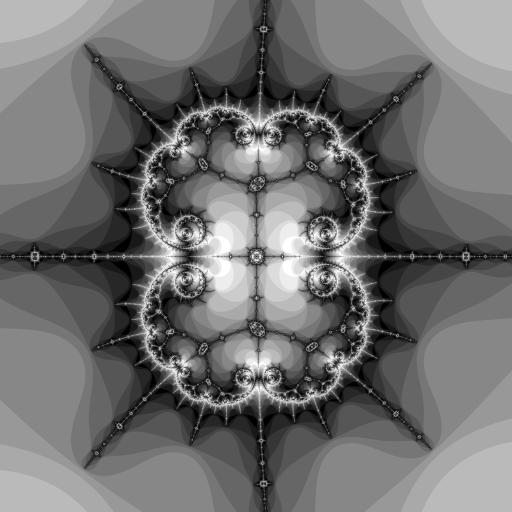
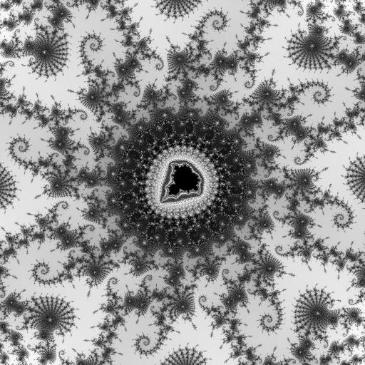
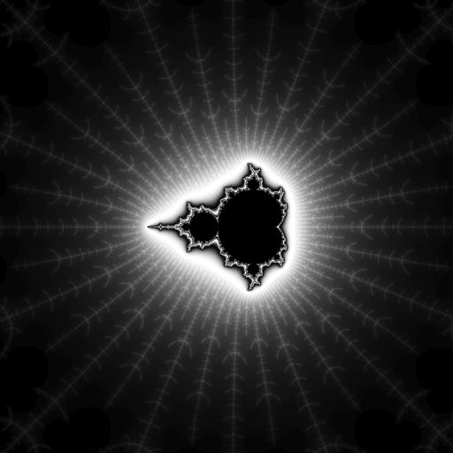
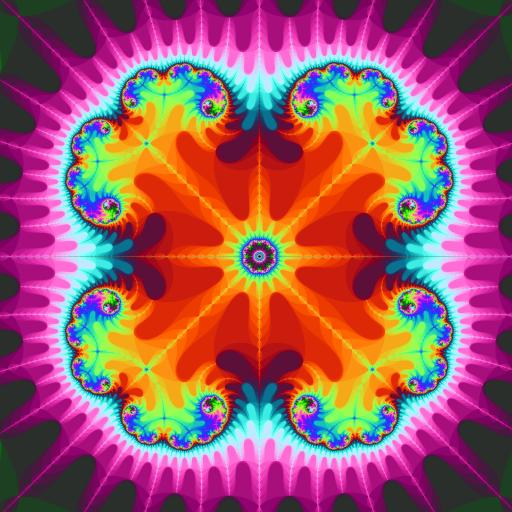
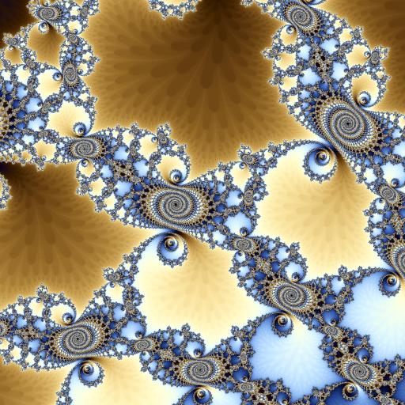
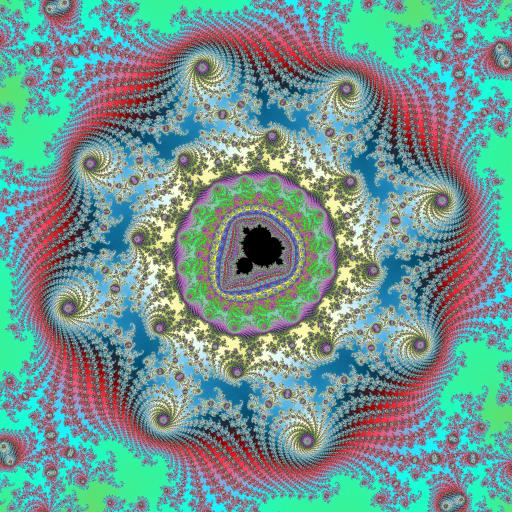
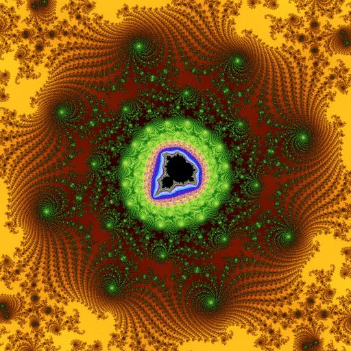

# gofra

`gofra` is simple fractal render library.



## Installation

To install `gofra`, simply run:
```
go get github.com/gitchander/gofra
```

## Getting started console util

Сonsole rendering program exists in the directory `gofra/cmd/gofra`

It used package: [cli.go](https://github.com/urfave/cli)

You will build console program:
```
$ cd gofra/cmd/gofra
$ go build
```

### Make default
For make default file config:
```
$ ./gofra default
```
in this case the file will be created `fractal.json`

### Render fractal
For render first fractal, run:
```
$ ./gofra draw
```
created image file `fractal.png`

```
$ ./gofra --image my_fractal.png draw
```
created image file `my_fractal.png`


you can watch it in any viewer program.

### Scale fractal

```
$ ./gofra scale 2
```
changed scale factor in configuration file.
for make fractal image you will render again.

Or you can run:
```
$ ./gofra --render scale 2
```
Also it makes render.

### Move position

For move center position used command move [w,a,s,d], where w,a,s,d are diractions like arrows.
The directions encodes with next characters:
```
'w' -> y += 0.5 // move up
'a' -> x -= 0.5 // move left
's' -> y -= 0.5 // move down
'd' -> x += 0.5 // move right
```

Examples:

```
./gofra move a
# x = -0.5, y = 0
```

```
./gofra move wd
# x = 0.5, y = 0.5
```

```
./gofra move sa
# x = -0.5, y = -0.5
```

```
./gofra move dds
# x = 1.0, y = -0.5
```

---

### Images









